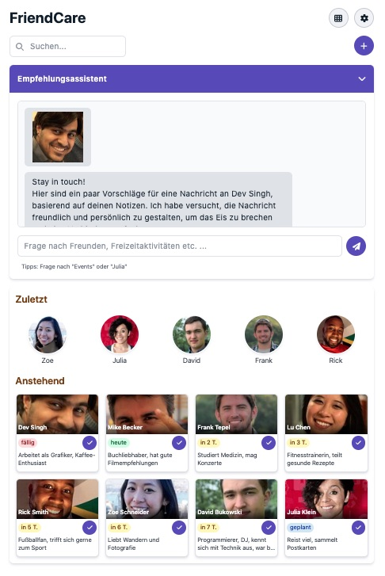
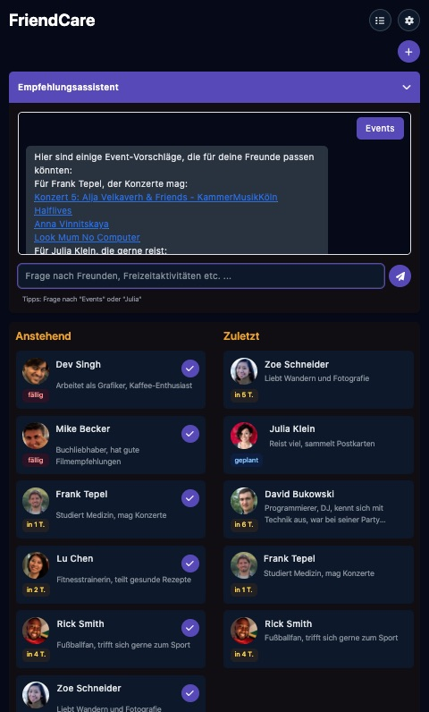

# FriendCare App

A Progressive Web App made with Vue 3 / Nuxt 3 and Tailwind CSS.  
Never forget to keep in contact with your friends on a regular basis.  
Set a an individual contact period for each of your friends and the app shows you the friends to cantact next.     
The AI Chatbot recommends message drafts and events that fit to your friend's interests.  

- progressive web app with persistent data saved to local storage
- local storage import and export
- light/dark mode
- grid view/table view
- profile image import (coverted to Base64)
- AI Chatbot (Google gemini-2.0-flash-lite LLM)




## Setup

Make sure to install dependencies:

```bash
# npm
npm install
```

## Development Server

Start the development server on `http://localhost:3000`:

```bash
# npm
npm run dev
```

## Production

Build the application for production:

```bash
# npm
npm run build
```

Locally preview production build:

```bash
# npm
npm run preview
```

Look at the [Nuxt documentation](https://nuxt.com/docs/getting-started/introduction) or
check out the [deployment documentation](https://nuxt.com/docs/getting-started/deployment) for more information.
